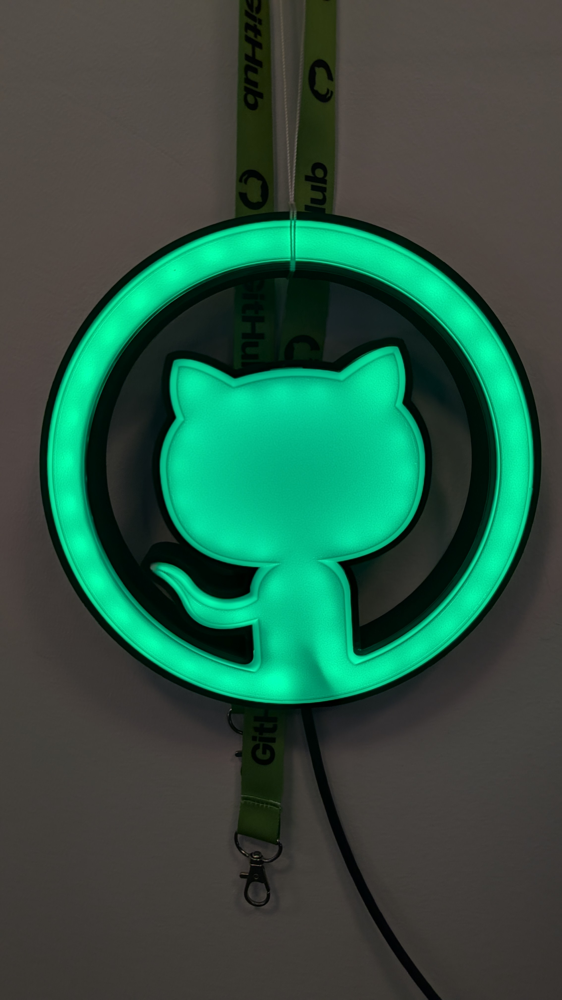
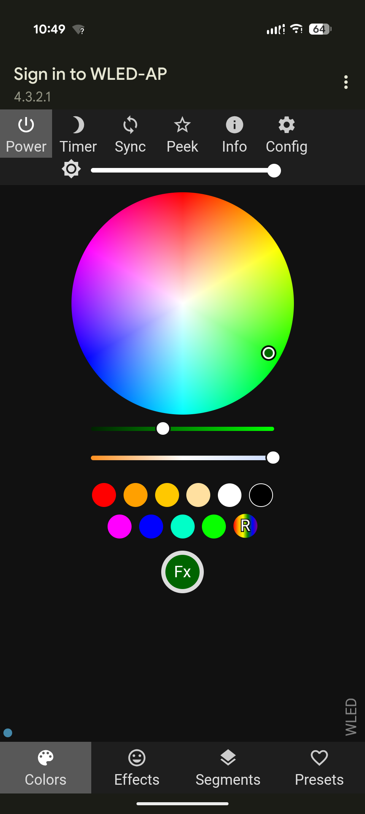

## Changes & Notes for GitHub Universe '25 Prep

Changes to the default behavior:
- LED Color is Green on boot (instead of orange)
- LED Brightness is 100% on boot (instead of 50%)
- LED Count is 110 on boot (instead of 30)

These changes are made to provide a more visually appealing demo experience directly out of the box, without requiring any initial configuration by the user.

## Deployment Steps
```sh
npm ci
```

```sh
npm run build
```

To flash an [ESP8266](https://www.amazon.com/dp/B0BR9GBNZH?ref=ppx_yo2ov_dt_b_fed_asin_title&th=1) chip connected via USB:
```sh
pio run -e esp8266_2m --target upload 
```

To flash an [ESP32](https://www.adafruit.com/product/6160) chip connected via USB:
```sh
pio run -e esp32dev --target upload
```

## Sample Images

<div style="display: flex; gap: 10px; align-items: flex-start;">
  
  
</div>
